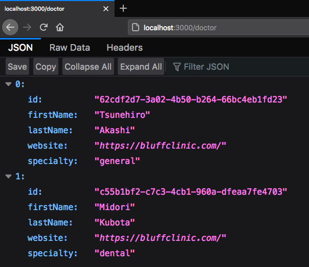

# Solo Project with TypeORM

This was created during my time as a student at Code Chrysalis

It's the start to an application I'd like to make to help English speakers in Japan find doctors that they can easily communicate with.

# Usage

Steps to run this project:

1. Run `yarn` command
2. Setup database settings inside `ormconfig.json` file
3. Run `yarn install` command
4. Run `yarn dev` command to start the server
5. Open browser to `localhost:3000/doctor`

# Documentation

## Methods
`app.get()`:
GET request to the homepage. \
`app.post()`: POST request to the homepage. \
`app.patch()`: PATCH request to the homepage used to make changes to the database. \
`app.delete()`: DELETE request to remove entries from the database. 